# DevOps Interview Q&A — Scenario & Example Based

Real interview questions with **scenarios**, **hands-on examples**, and **diagrams** tied to this portfolio (express-api, EKS, ArgoCD).

---

## Table of Contents

1. [General DevOps & CI/CD](#1-general-devops--cicd)
2. [Docker Scenarios](#2-docker-scenarios)
3. [Kubernetes Scenarios](#3-kubernetes-scenarios)
4. [GitOps & ArgoCD Scenarios](#4-gitops--argocd-scenarios)
5. [Terraform & AWS EKS Scenarios](#5-terraform--aws-eks-scenarios)
6. [Monitoring & Incident Response](#6-monitoring--incident-response)
7. [DevSecOps Scenarios](#7-devsecops-scenarios)
8. [System Design Scenarios](#8-system-design-scenarios)
9. [Mock Interview — Full Scenario Round](#9-mock-interview--full-scenario-round)

---

## 1. General DevOps & CI/CD

### Q1. [Scenario] Your team releases once a month with manual deployments and frequent rollbacks. How would you improve this?

**Situation:** Dev team throws code over the wall; ops deploys manually at 2 AM; rollbacks take hours.

**Answer — phased approach:**

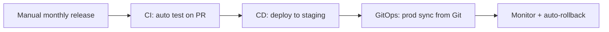

| Phase | Action | Outcome |
|-------|--------|---------|
| Week 1–2 | GitHub Actions: test + build on every PR | Catch bugs before merge |
| Week 3–4 | Docker + deploy to dev K8s automatically | Repeatable environments |
| Month 2 | ArgoCD GitOps for prod | Deploy = git merge; rollback = git revert |
| Month 3 | Prometheus alerts + runbooks | MTTR drops from hours to minutes |

**Example from portfolio:**
```yaml
# .github/workflows/ci.yml — runs on every push
npm test → npm audit → docker build → trivy scan → kubeconform validate
```

**Result to mention in interview:** "Deployment frequency increased, change failure rate dropped, rollback became a 2-minute git revert instead of a 2-hour manual process."

---

### Q2. [Scenario] Draw and explain your CI/CD pipeline for a Node.js microservice.

**Diagram:**

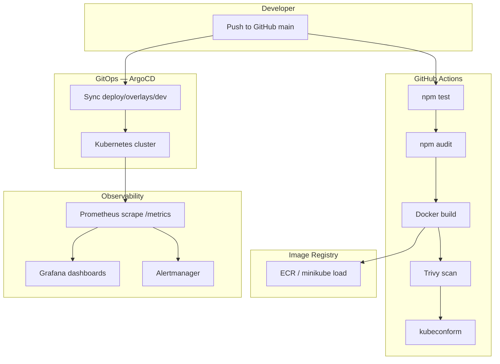

**Walk-through script:**
> "Developer pushes to main. CI runs tests and security scans, builds an immutable image tagged with the git SHA. The Kustomize overlay references that tag. ArgoCD detects the Git change and syncs to the cluster. Prometheus scrapes `/metrics` and alerts fire if CPU or availability SLOs break."

---

### Q3. [Scenario] Developer asks: "Why can't I just SSH into the server and update the file?"

**Answer:** Explain **immutable infrastructure**.

| Manual SSH | GitOps / CI/CD |
|------------|----------------|
| No audit trail | Every change in Git history |
| Snowflake servers | Identical containers every deploy |
| "Works on my machine" | Same image dev → prod |
| Rollback = guess what changed | Rollback = `git revert` |

**Scenario follow-up:** "Last week someone SSH'd a config fix but didn't document it. Next deploy overwrote it and caused an outage." → GitOps prevents this because cluster state always matches Git.

---

## 2. Docker Scenarios

### Q4. [Scenario] Security team flagged your Docker image — it runs as root and is 1.2 GB. Fix it.

**Before vs After:**

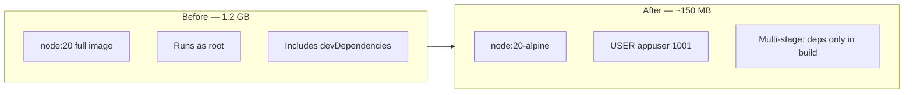

**Example fix (from express-api Dockerfile):**

```dockerfile
# Stage 1: install deps
FROM node:20-alpine AS deps
COPY package*.json ./
RUN npm ci --omit=dev

# Stage 2: production
FROM node:20-alpine AS production
RUN adduser -S appuser -u 1001
COPY --from=deps --chown=appuser:appgroup /app/node_modules ./node_modules
USER appuser
ENTRYPOINT ["dumb-init", "--"]
CMD ["node", "src/index.js"]
```

**Interview talking points:**
- Multi-stage → no build tools in final image
- Alpine → smaller base
- Non-root → container escape impact reduced
- dumb-init → graceful SIGTERM handling in K8s

---

### Q5. [Scenario] Container starts then immediately exits in Kubernetes. How do you debug?

**Step-by-step scenario:**

```bash
# 1. Check pod status
kubectl get pods -n express-api
# STATUS: CrashLoopBackOff

# 2. Describe — look at Events
kubectl describe pod express-api-xxx -n express-api
# Events: Back-off restarting failed container

# 3. Logs from previous crash
kubectl logs express-api-xxx -n express-api --previous

# 4. Common causes checklist
```

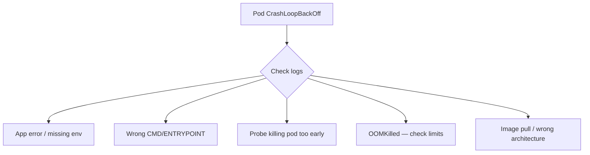

**Real example from our project:**
```
Startup probe failed: HTTP 404 on /health/live
```
**Root cause:** Old image without `/health/live` endpoint. **Fix:** Rebuild image OR patch probe to `/health` until new image deployed.

---

### Q6. [Scenario] Explain what happens when you run `docker build` and `docker run`.

**Diagram:**

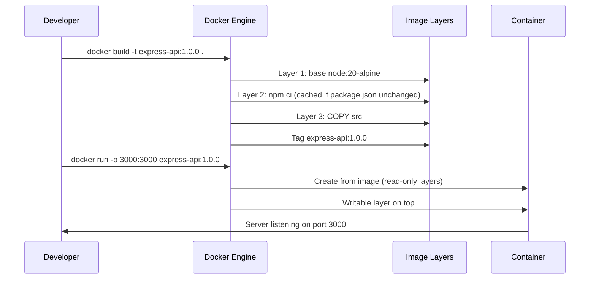

---

## 3. Kubernetes Scenarios

### Q7. [Scenario] Draw Kubernetes architecture and explain what happens when you `kubectl apply -f deployment.yaml`.

**Architecture:**

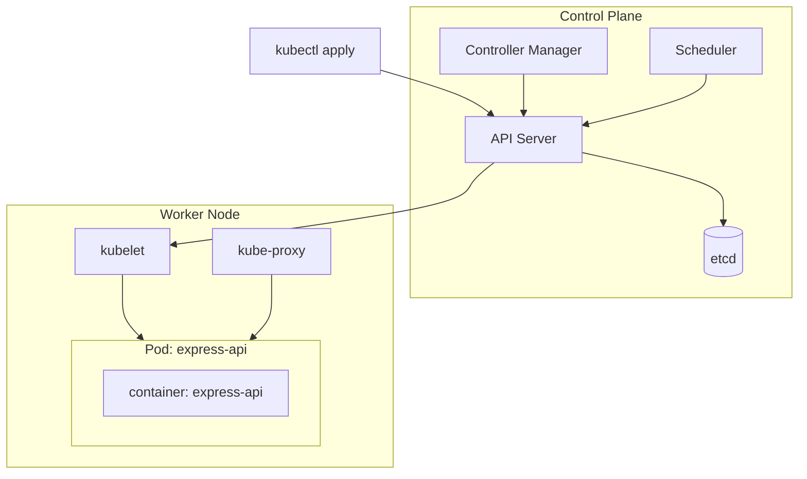

**Sequence when applying Deployment:**
1. kubectl sends manifest to **API server**
2. Stored in **etcd**
3. **Deployment controller** creates ReplicaSet
4. **Scheduler** assigns Pod to node
5. **kubelet** pulls image, starts container
6. **kube-proxy** updates Service endpoints when readiness passes

---

### Q8. [Scenario] Users report 502 Bad Gateway after a deployment. Debug it.

**Scenario:** You deployed express-api v1.0.1. Ingress returns 502. Pods show Running.

**Debug flowchart:**

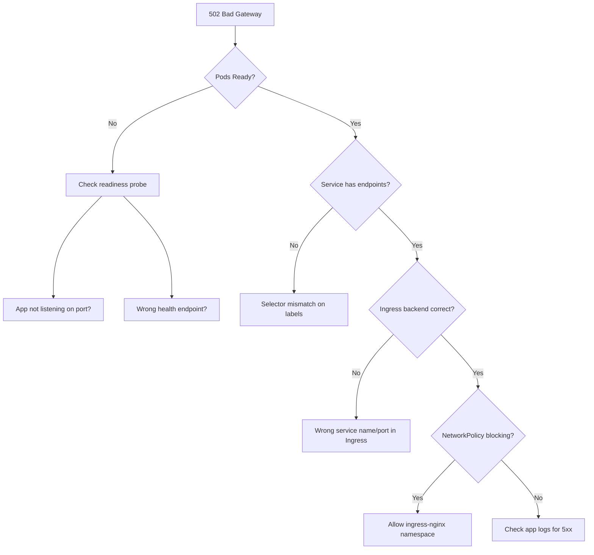

**Commands:**
```bash
kubectl get pods -n express-api
kubectl get endpoints express-api -n express-api
kubectl describe ingress express-api -n express-api
kubectl logs -l app=express-api -n express-api --tail=50
```

**Real fix example:** Readiness probe pointed to `/health/ready` but old image only had `/health` → endpoints empty → 502.

---

### Q9. [Scenario] Explain liveness vs readiness with a database dependency.

**Scenario:** express-api connects to PostgreSQL. DB goes down for 5 minutes.

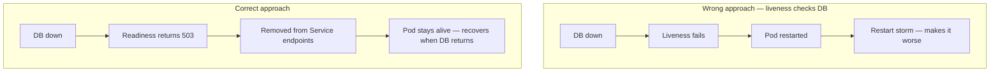

**Our implementation:**

| Endpoint | Purpose | DB down behavior |
|----------|---------|------------------|
| `/health/live` | Liveness probe | Returns 200 (process alive) |
| `/health/ready` | Readiness probe | Returns 503 (not ready for traffic) |

```javascript
// Readiness — fail when not ready, don't kill pod
app.get('/health/ready', (_req, res) => {
  if (!isReady) return res.status(503).json({ status: 'not_ready' });
  res.status(200).json({ status: 'ready' });
});
```

---

### Q10. [Scenario] How do Kustomize base and overlays work for dev vs prod?

**Diagram:**

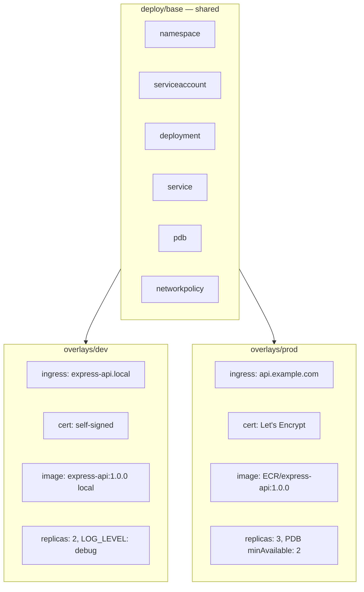

**Apply commands:**
```bash
kubectl apply -k deploy/overlays/dev    # minikube / dev cluster
kubectl apply -k deploy/overlays/prod   # production cluster
```

**Interview answer:** "Base holds environment-agnostic manifests. Overlays patch image, replicas, ingress host, and TLS without duplicating YAML. ArgoCD dev Application points to `deploy/overlays/dev`, prod Application points to `deploy/overlays/prod`."

---

### Q11. [Scenario] Cluster admin drains a node for maintenance. What happens to your app?

**Scenario:** 2 replicas on 2 nodes. One node is cordoned and drained.

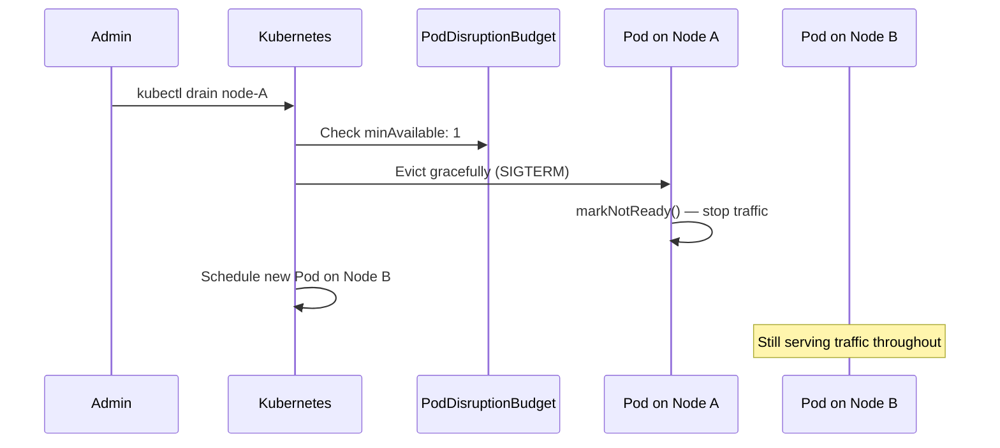

**Our PDB config:**
```yaml
spec:
  minAvailable: 1   # prod overlay patches to 2
  selector:
    matchLabels:
      app: express-api
```

---

## 4. GitOps & ArgoCD Scenarios

### Q12. [Scenario] Explain GitOps flow from git push to running app.

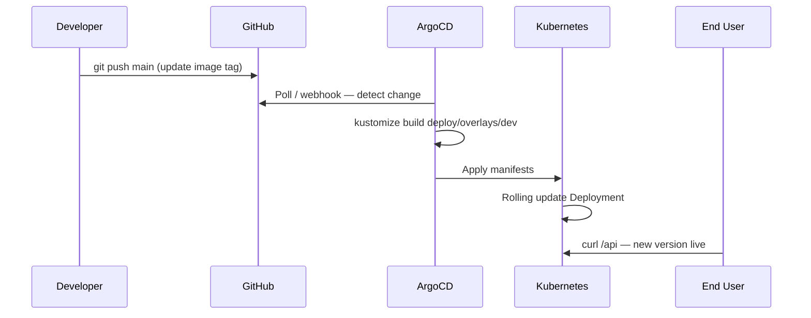

**Key interview phrase:** "The cluster converges to Git. Manual kubectl changes are overwritten by self-heal."

---

### Q13. [Scenario] ArgoCD shows OutOfSync but you didn't change Git. What happened?

**Scenario:** On-call engineer ran `kubectl scale deployment express-api --replicas=5` manually.

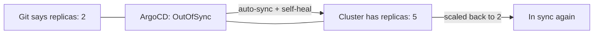

**Debug steps:**
```bash
kubectl get applications -n argocd
argocd app diff express-api-dev
argocd app history express-api-dev
```

**Answer:** "Someone caused configuration drift. With self-heal enabled, ArgoCD reverts manual changes. Without it, we'd investigate the diff and either update Git or sync."

---

### Q14. [Scenario] Design App-of-Apps bootstrap for a new cluster.

**Diagram (our setup):**

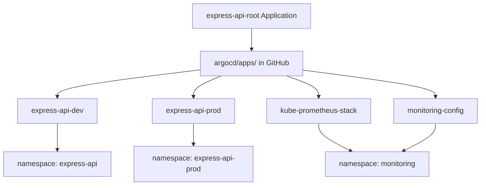

**Bootstrap commands:**
```bash
kubectl apply -f argocd/application.yaml   # Creates project + root app
# Root app syncs child apps from Git automatically
```

---

## 5. Terraform & AWS EKS Scenarios

### Q15. [Scenario] Draw AWS EKS architecture from our Terraform project.

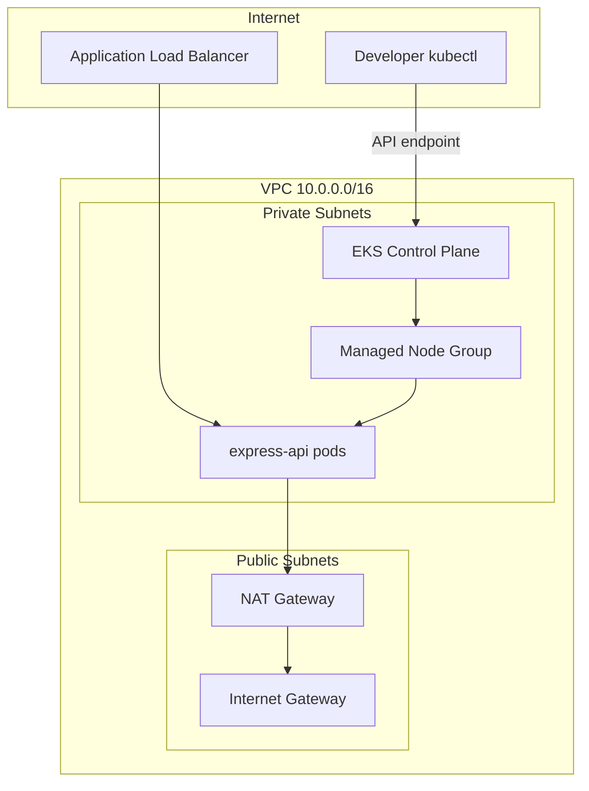

**Security layers to mention:**
- Nodes in **private subnets** (no direct internet)
- EKS API endpoint CIDR-restricted
- **KMS encryption** for etcd secrets
- **IMDSv2** required on nodes
- **VPC flow logs** enabled

---

### Q16. [Scenario] `terraform apply` fails with state lock error. What do you do?

**Scenario:** Colleague's apply crashed mid-run. You run apply and see:
```
Error: Error acquiring the state lock
Lock ID: abc123...
```

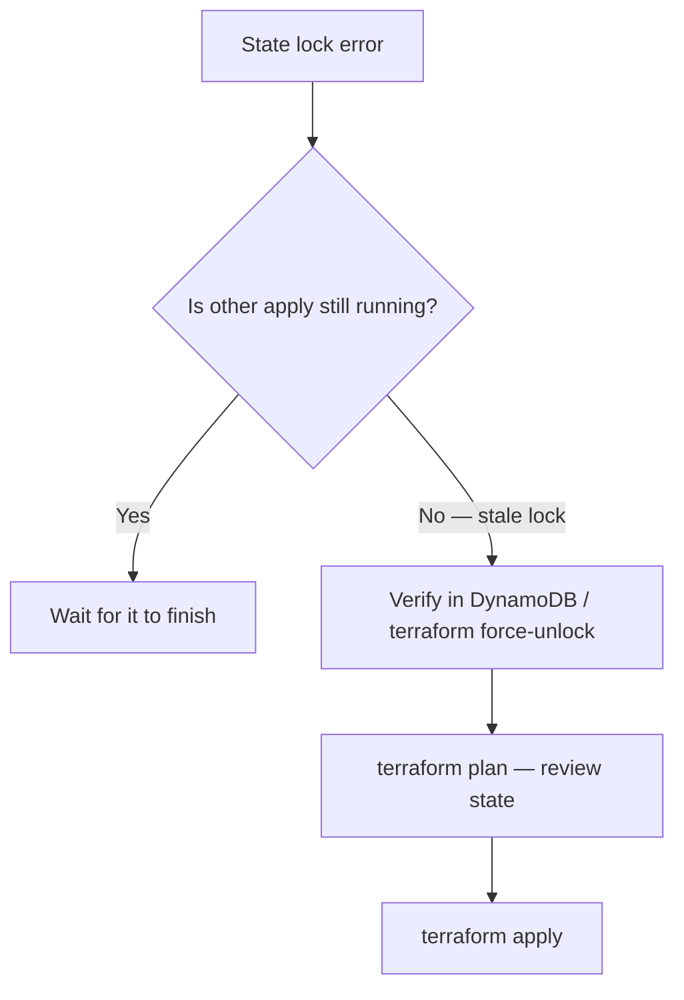

**Commands:**
```bash
terraform force-unlock abc123   # Only if confirmed stale!
terraform plan                  # Verify state consistency
```

**Prevention:** Remote state in S3 + DynamoDB locking (configured in our `versions.tf`).

---

### Q17. [Scenario] Company requires all EKS secrets encrypted. How do you implement it?

**Example from eks-terraform/kms.tf:**

```hcl
resource "aws_kms_key" "eks" {
  enable_key_rotation = true
}

module "eks" {
  cluster_encryption_config = {
    resources        = ["secrets"]
    provider_key_arn = aws_kms_key.eks.arn
  }
}
```

**Diagram:**

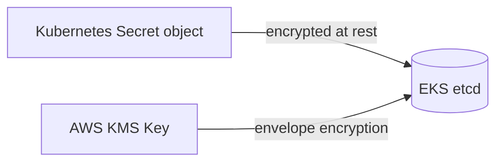

**Interview tip:** Distinguish etcd encryption (at rest in AWS) vs Sealed Secrets / External Secrets (how secrets get into GitOps safely).

---

## 6. Monitoring & Incident Response

### Q18. [Scenario] Prometheus alert fires: ExpressApiHighCPU. Walk through response.

**Alert rule (from our project):**
```yaml
- alert: ExpressApiHighCPU
  expr: rate(process_cpu_seconds_total{namespace="express-api"}[5m]) > 0.2
  for: 2m
  severity: warning
```

**Incident response flow:**

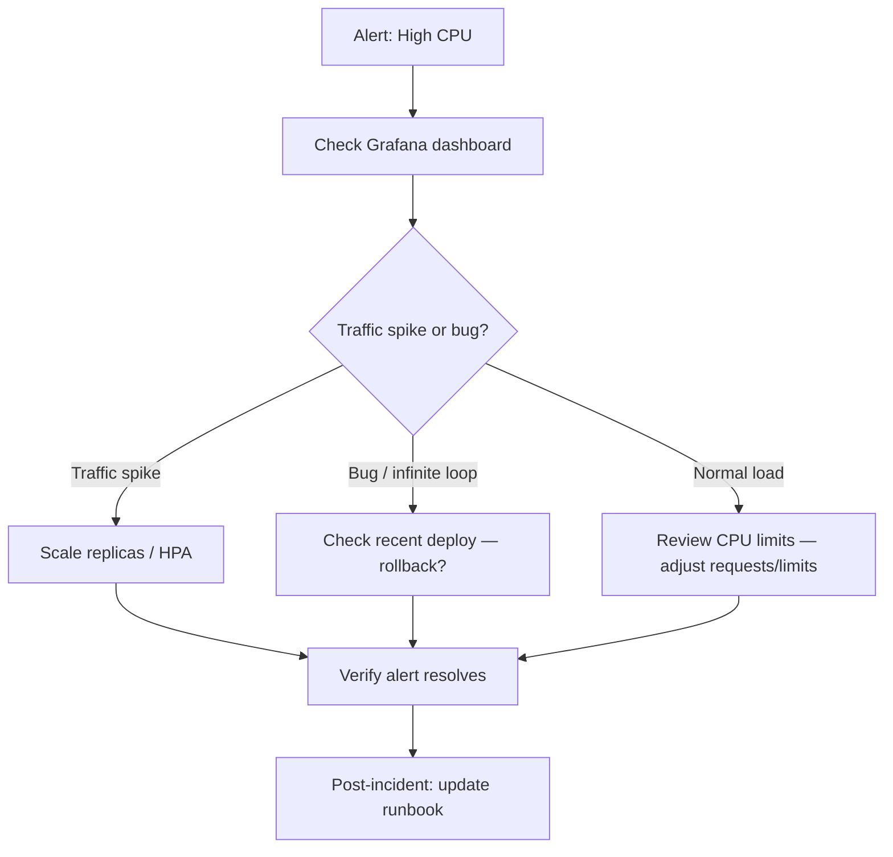

**Commands:**
```bash
kubectl top pods -n express-api
kubectl logs -l app=express-api -n express-api --tail=100
kubectl port-forward svc/kube-prometheus-stack-prometheus -n monitoring 9090:9090
# Check Prometheus → Alerts → Firing
```

---

### Q19. [Scenario] Design observability stack for express-api.

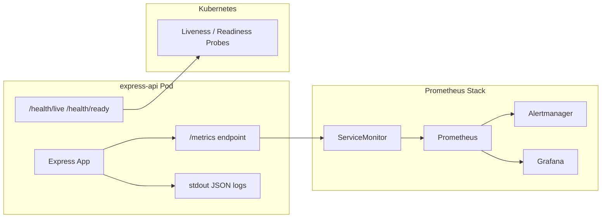

| Signal | Tool | What we monitor |
|--------|------|-----------------|
| Metrics | Prometheus | CPU, memory, up{}, request rate |
| Dashboards | Grafana | Express API dashboard |
| Alerts | Alertmanager | High CPU, down, high memory |
| Logs | kubectl / Loki | Structured JSON via Pino |
| Health | K8s probes | Pod restart / traffic routing |

---

### Q20. [Scenario] 3 AM page: "Site is down." Full incident process.

**STAR method answer:**

| Step | Action |
|------|--------|
| **S** — Situation | PagerDuty alert: `ExpressApiDown`, users report 503 |
| **T** — Task | Restore service within 15 min SLA |
| **A** — Action | See flowchart below |
| **R** — Result | Rolled back bad deploy, 8 min MTTR, post-mortem scheduled |

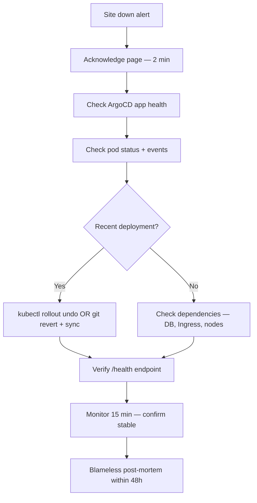

**Quick command cheat sheet:**
```bash
kubectl get pods,svc,ingress -n express-api
kubectl rollout history deployment/express-api -n express-api
kubectl rollout undo deployment/express-api -n express-api
argocd app sync express-api-dev --force
```

---

## 7. DevSecOps Scenarios

### Q21. [Scenario] Security audit finds `/metrics` exposed publicly. Fix it.

**Scenario:** Pen test shows `https://api.example.com/metrics` leaks internal process data.

**Before (vulnerable):**
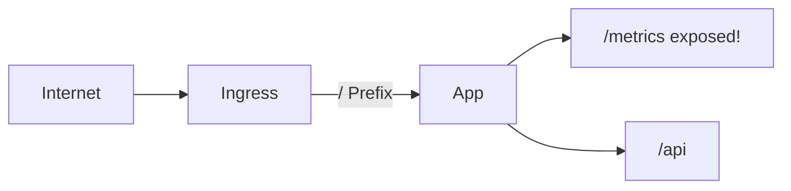

**After (fixed — our setup):**
```mermaid
flowchart LR
    Internet --> Ingress
    Ingress -->|"/api only"| App
    Ingress -->|"/health only"| App
    Prom[Prometheus in monitoring NS] -->|NetworkPolicy allow| Metrics["/metrics internal only"]
```

**Fixes applied:**
1. Ingress paths: only `/health` and `/api` (not `/` Prefix covering `/metrics`)
2. NetworkPolicy: allow port 3000 only from `ingress-nginx` and `monitoring` namespaces
3. ServiceMonitor: Prometheus scrapes internally

---

### Q22. [Scenario] Trivy finds CRITICAL CVE in base image during CI. What do you do?

**Scenario:** Pipeline fails on:
```
CVE-2024-XXXX (CRITICAL) — libssl in node:20-alpine
```

```mermaid
flowchart TD
    A[Trivy CRITICAL CVE] --> B{Fix available?}
    B -->|Yes| C[Update base image tag / rebuild]
    B -->|No| D[Assess: reachable in our app?]
    D --> E{Exploitable?}
    E -->|No| F[Document exception + monitor]
    E -->|Yes| F2[Switch base / add WAF / block deploy]
    C --> G[Rebuild + re-scan + deploy]
```

**CI gate (our pipeline):**
```yaml
- uses: aquasecurity/trivy-action@0.28.0
  with:
    exit-code: 1
    severity: CRITICAL,HIGH
```

---

### Q23. [Scenario] Developer committed AWS credentials to Git. Response?

**Immediate response (scenario playbook):**

```mermaid
flowchart TD
    A[Secrets in Git] --> B[Rotate credentials NOW]
    B --> C[Remove from Git history — BFG / git filter-repo]
    C --> D[Enable secret scanning — GitHub Advanced Security]
    D --> E[Use AWS Secrets Manager / External Secrets]
    E --> F[Pre-commit hook — detect-secrets]
```

**Never say:** "Just delete the file in the next commit" — secrets remain in Git history.

---

## 8. System Design Scenarios

### Q24. [Scenario] Design CI/CD for 10 microservices on EKS.

```mermaid
flowchart TB
    subgraph Services["10 Microservices"]
        S1[express-api]
        S2[auth-service]
        S3[...]
    end

    subgraph CI["Shared CI Template"]
        Test[Test + Scan]
        Build[Build + Push ECR]
        Update[Update Kustomize image tag in Git]
    end

    subgraph GitOps["ArgoCD"]
        AppSet[ApplicationSet — one app per service]
    end

    subgraph Clusters["EKS Clusters"]
        Dev[dev cluster]
        Prod[prod cluster]
    end

    Services --> CI --> GitOps
    GitOps --> Dev
    GitOps --> Prod
```

**Key decisions to mention:**
| Decision | Choice | Why |
|----------|--------|-----|
| Mono vs multi repo | Mono repo or multi with ApplicationSet | Easier onboarding vs isolation |
| Promotion | Image tag update in overlay Git | Audit trail |
| Secrets | External Secrets Operator + AWS SM | No secrets in Git |
| Environments | Separate EKS clusters for dev/prod | Blast radius |

---

### Q25. [Scenario] Zero-downtime deployment for express-api.

**Strategy comparison for our 2-replica app:**

```mermaid
flowchart TB
    subgraph Rolling["Rolling Update (our default)"]
        R1[Pod v1 running] --> R2[Pod v2 starts]
        R2 --> R3[Readiness passes]
        R3 --> R4[Pod v1 terminated]
    end

    subgraph Requirements["Requirements for zero downtime"]
        REQ1[Readiness probe correct]
        REQ2[PDB minAvailable: 1]
        REQ3[preStop hook / graceful shutdown]
        REQ4[RollingUpdate maxUnavailable: 0]
    end
```

**Graceful shutdown (our index.js):**
```javascript
process.on('SIGTERM', () => {
  markNotReady();           // Stop receiving traffic
  server.close(() => process.exit(0));  // Finish in-flight requests
});
```

**Deployment strategy:**
```yaml
spec:
  strategy:
    type: RollingUpdate
    rollingUpdate:
      maxUnavailable: 0
      maxSurge: 1
```

---

## 9. Mock Interview — Full Scenario Round

### Round 1: "Tell me about a DevOps project you built."

**Suggested 2-minute answer (STAR):**

> **Situation:** I needed a portfolio project demonstrating end-to-end DevOps.
>
> **Task:** Build a production-grade API with containerization, K8s, GitOps, monitoring, and IaC.
>
> **Action:** I built express-api — Node.js with structured logging and Prometheus metrics. Multi-stage Docker with non-root user. Kustomize base/overlays for dev and prod. ArgoCD syncs from GitHub automatically. Prometheus/Grafana with CPU and availability alerts. Terraform provisions EKS with KMS encryption and private subnets. GitHub Actions runs tests, Trivy scans, and validates manifests.
>
> **Result:** Full GitOps pipeline — git push triggers CI, ArgoCD deploys, alerts fire on SLO breach. Rollback is a git revert.

---

### Round 2: Live troubleshooting scenario

**Interviewer:** "Pods are Running but the Service returns no endpoints. Go."

```bash
# Step 1
kubectl get pods -n express-api -o wide
kubectl get svc express-api -n express-api -o yaml | grep selector

# Step 2 — label mismatch?
kubectl get pods --show-labels -n express-api

# Step 3 — readiness failing?
kubectl describe pod -n express-api | grep -A5 "Readiness"

# Step 4
kubectl get endpoints express-api -n express-api
```

**Common answer:** Readiness probe failing → pods not added to endpoints → Service has no backends.

---

### Round 3: Whiteboard scenario

**Interviewer:** "Draw how a HTTP request flows from internet to your pod."

```mermaid
sequenceDiagram
    participant User
    participant DNS
    participant Ingress as NGINX Ingress
    participant Svc as Service express-api:80
    participant Pod as Pod :3000

    User->>DNS: GET express-api.local
    DNS->>Ingress: Route to Ingress Controller
    Ingress->>Ingress: TLS termination (cert-manager)
    Ingress->>Svc: Forward to express-api:80
    Svc->>Pod: kube-proxy → pod IP:3000
    Pod->>User: JSON response
```

---

## Quick Reference — Command Cheat Sheet

```bash
# Kubernetes
kubectl get pods,svc,ingress -n express-api
kubectl describe pod <name> -n express-api
kubectl logs -f -l app=express-api -n express-api
kubectl rollout undo deployment/express-api -n express-api

# ArgoCD
kubectl get applications -n argocd
argocd app diff express-api-dev
argocd app sync express-api-dev --force

# Docker
docker build -t express-api:1.0.0 .
trivy image express-api:1.0.0

# Terraform
terraform plan && terraform apply
terraform state list

# Monitoring
kubectl port-forward svc/kube-prometheus-stack-grafana -n monitoring 3000:80
kubectl port-forward svc/kube-prometheus-stack-prometheus -n monitoring 9090:9090
```

---

## Interview Day Checklist

- [ ] Can draw CI/CD pipeline from memory
- [ ] Can explain liveness vs readiness with DB failure scenario
- [ ] Can debug CrashLoopBackOff and 502 step-by-step
- [ ] Can explain GitOps flow and App-of-Apps
- [ ] Can walk through EKS architecture with VPC
- [ ] Can describe one incident response with STAR method
- [ ] Can explain one security fix (metrics exposure, non-root, Trivy)

---

*Practice saying answers out loud. Interviewers care about **how you think through scenarios**, not memorized definitions.*

*Portfolio repos: [express-api](https://github.com/laxmanperi1/express-api) | [eks-terraform](https://github.com/laxmanperi1/eks-terraform)*
